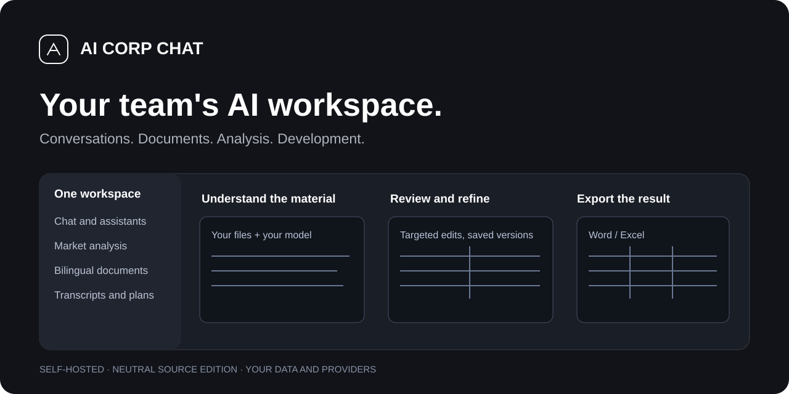
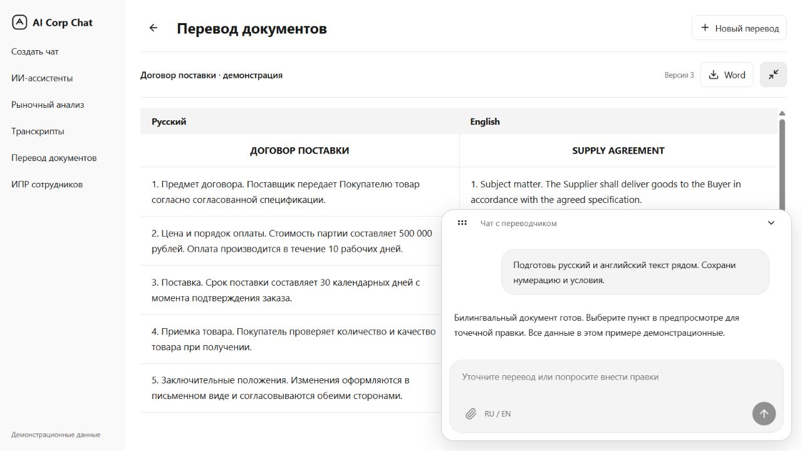
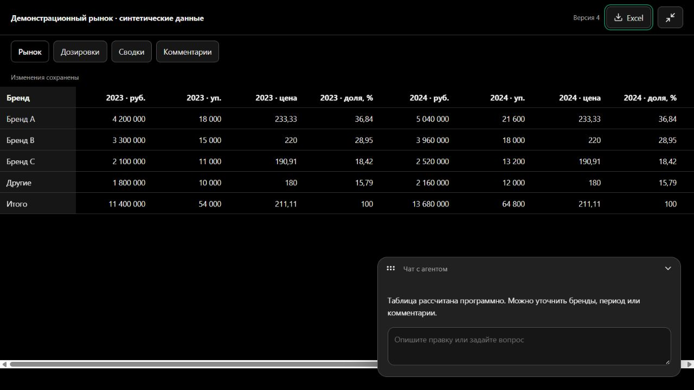
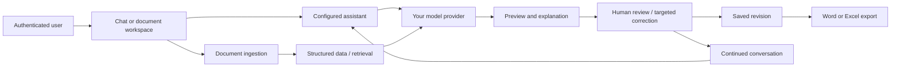

# AI Corp Chat

**A team's AI workspace for conversations, documents, analysis and development plans.**

**English** · [Русский](README.ru.md)

A self-hosted corporate AI platform built on LibreChat, extended with document translation, market-report automation, transcript handling and employee development history. People work with assistants in chat, review their documents, make targeted corrections and download the resulting reports from one interface.



> **Status:** a portable, anonymized source edition of an existing application. The main interface is Russian; the documentation is available in English and Russian. No original accounts, conversations, employee records, uploaded documents, company branding or provider credentials are included. Ten assistant definitions are supplied with neutral ownership and without their original knowledge files. Model responses require your own configured providers; there is no hidden mock pretending to be a working model.

[Quick start](#quick-start) · [Features](#included-features) · [Screenshots](#screenshots) · [Integrations](#connect-your-models-and-knowledge) · [Access](#roles-and-data-boundaries) · [Architecture](#architecture-and-storage) · [Checks](#development-and-verification) · [Limitations](#current-limitations) · [Contributing](CONTRIBUTING.md) · [License](LICENSE)


The private reference workbook and its extracted product-description catalog are not included. `api/server/services/MarketAnalysis/reference-catalog.json` is an empty, operator-editable template; add authorized reference entries with provenance or use the module’s document research. The report layout and calculation/export tools remain available.

## What you can run

| Goal | Included | What you supply |
|---|---|---|
| Run an independent corporate chat | Accounts, personal conversations, search, pinned/recent chats, assistants, administration, responsive light/dark interface | Docker, a model account and your own users |
| Produce market reports | Document ingestion, analysis memory, deterministic calculations, source research, live table preview and a two-sheet Excel export | Market spreadsheets, access to any licensed sources, a text model and a vision model where necessary |
| Prepare bilingual documents | DOCX/PDF input, RU/EN preview, targeted AI/manual edits, revision tracking and Word export | Translation model; Gemini/Vertex for visual PDF reading |
| Maintain development history | Transcript workspace, coaching assistants, saving analysis to individual plans, employee search and dynamics | Manager roles, your own transcripts and a configured model |
| Publish a reusable source repository | Neutral branding, English/Russian documentation, images, environment templates, CI and source checks | Your repository, hosting configuration and integration credentials |

The copy preserves application capabilities, **not another installation's data or connected accounts**. An empty knowledge store cannot answer from documents that have not been supplied. Provider quotas, prices and supported model IDs belong to your own account and must be checked before deployment.

## Problems it addresses

| Problem | Approach |
|---|---|
| AI tools and business documents are spread across different screens | A shared chat shell and dedicated document workspaces |
| Market tables are assembled through repetitive Excel copying | Structured import, programmatic calculations and a consistent export |
| A translation correction requires regenerating the whole document | Clause selection, targeted changes and revision-aware saving |
| A file preview prevents continued discussion | A movable, collapsible chat over the document |
| Coaching analyses disappear into unrelated conversations | A separate development history tied to employees and authorized managers |
| A project copy carries production credentials and employee files | Fresh configuration, empty persistence and anonymized assistant seeds |

AI output remains a draft for human review. The application does not guarantee factual correctness, legal adequacy of a translation, access to a paid database or the quality of an employee-development recommendation.

## Included features

- **Chat:** personal sessions, streaming responses, files, search, pinned/recent conversations, copy/rating/speech actions and document exports.
- **Assistants:** a catalog of ten seeded definitions, file-search support, editable instructions, provider settings, permissions and four supplier/document MCP tools.
- **Market analysis:** input from spreadsheets and other supported document formats; DSM Group/AlphaRM source handling; ranking, selected brands and “other” aggregation; market totals, shares, price metrics, growth and CAGR; template comments; source/check metadata and analysis-specific memory.
- **Report preview:** market/dosage tables, discussion during review, updates after accepted edits and a single Excel download containing the two user-facing sheets.
- **Document translation:** DOCX and PDF, Russian/English columns, clause selection, targeted AI edits, manual editing of both languages, version conflicts, prior clause text and the latest bilingual Word export.
- **Transcripts and development plans:** transcript upload, saved analyses, employee search, MP/RM/RGR/newcomer categories and dynamics dashboards under manager permissions.
- **Administration:** users, roles, positions/departments, assistant configuration, balances/transactions and provider setup inherited from the underlying application.
- **Deployment:** a custom application image, MongoDB, Meilisearch, vector PostgreSQL, OCR-enabled RAG and an optional Caddy HTTPS gateway.

For the exact module boundaries and formats, see [the module guide](docs/MODULES.md). A feature requiring an external service is available only after that service is configured.

## Screenshots

The screenshots below use **synthetic demonstration documents** and the actual module components. They contain no employee records and are not evidence of a completed live model run.

### Bilingual document review



### Market-report workspace



## How it works



Market calculations are performed programmatically; a language model interprets the task, resolves ambiguous mappings and explains results. Translation saves validated edits to the selected clauses. Neither process should silently replace the rest of the document. The current job coordination uses one application process and in-memory locks, so run **one API replica** until distributed locking is implemented.

## Quick start

Requirements: **Node.js 22+**, npm, and Docker Engine with Docker Compose v2. The full image build needs enough memory for the frontend (a 6 GB Node build limit is configured). On Windows, Docker Desktop must be running in Linux-container mode.

From the repository root:

```bash
npm run setup
```

This generates `.env` with new signing/encryption keys, database passwords, a search key and an administrator password. It leaves model credentials empty and preserves an existing `.env`.

Edit `.env` before starting:

1. Set `ADMIN_EMAIL` and `ADMIN_NAME` for your own instance. The generated `ADMIN_PASSWORD` is stored in that local file; the setup command does not print it.
2. Set `DEEPSEEK_API_KEY` for the default chat/internal text provider, or configure the Gemini alternative described below.
3. Set `GOOGLE_KEY`, or your own Vertex service-account path, for visual PDF and market-document interpretation.
4. Configure embeddings for document search. The default RAG template expects `OPENAI_API_KEY` with `text-embedding-3-small`; another supported embedding provider requires its own settings.
5. Adjust `CHAT_MODEL`, `DEEPSEEK_MODEL` and `CORP_GEMINI_MODEL` to models supported by your account. The template's identifiers are configurable examples, not availability guarantees.

Then:

```bash
docker compose config -q
docker compose up -d --build
docker compose ps
```

Open **http://localhost:3088**. Sign in using your local `ADMIN_EMAIL` and `ADMIN_PASSWORD`. Bootstrap creates an administrator only on an empty user database and seeds the ten assistants. Repeated startup preserves existing accounts, passwords, assistant instructions and history.

Useful commands:

```bash
docker compose logs --tail=100 api
docker compose exec api npm run seed:agents
docker compose stop
docker compose start
```

Do not use `down -v` when you intend to preserve data: it removes named volumes. Provider credentials are never restored from the source edition. See [deployment instructions](docs/DEPLOYMENT.md) for HTTPS, backups and native development.

## Connect your models and knowledge

| Function | Configuration | Notes |
|---|---|---|
| Chat and default seeded assistants | `CHAT_PROVIDER=DeepSeek`, `CHAT_MODEL`, `DEEPSEEK_API_KEY`, `DEEPSEEK_BASE_URL` | `librechat.yaml` contains an OpenAI-compatible custom endpoint |
| Internal text generation | `CORP_INTERNAL_AI_PROVIDER=deepseek`, `DEEPSEEK_MODEL` | Translation, development parsing/dynamics and transcript titles use this adapter |
| Gemini internal generation | `CORP_INTERNAL_AI_PROVIDER=gemini`, `GOOGLE_KEY`, `CORP_GEMINI_MODEL` | Uses your own Google account |
| Vertex AI | `GOOGLE_SERVICE_KEY_FILE=/app/secrets/google-service-account.json`, `GOOGLE_LOC` | Put your key in ignored `secrets/`; no service account is bundled |
| Seed assistants on Gemini | `CHAT_PROVIDER=google`, `CHAT_MODEL=<your Gemini model>` before first seed | Existing assistants retain their settings; change them in the administration/builder UI afterwards |
| Visual PDF / market documents | `GOOGLE_KEY` or Vertex credentials | A text-only DeepSeek configuration does not enable visual PDF extraction |
| Document retrieval | `EMBEDDINGS_PROVIDER`, `EMBEDDINGS_MODEL`, embedding-provider key | OCR and vector retrieval are a separate RAG service |
| General web search | Search-provider variables and `librechat.yaml` | An empty key is not a configured search provider |
| Speech and email | `STT_*`, `TTS_*`, `EMAIL_*` and provider configuration | Optional; browser/provider capabilities differ |

**DSM Group and AlphaRM remain named public research sources.** Their public pages are not a license to access closed datasets. Upload authorized exports when data is unavailable publicly; distinguish verified figures from missing or inferred information. The module does not bypass login or paywalls and must not combine overlapping market sources as if they were separate sales.

Original assistant knowledge files, vector IDs, tool-resource bindings and contact details were not copied. Supply your own corpus, attach it to the relevant assistants and test retrieval. The included Gemini compatibility patch is applied during installation; it makes the customized tool integration reproducible without production bind mounts.

## Roles and data boundaries

| Area | Default boundary in this edition |
|---|---|
| Personal chat and document translation | User-owned sessions/documents; admin status does not make another user's translations appear in the personal list |
| Market analysis | Available to authenticated users; the original email whitelist is removed; analyses remain user-owned |
| Assistant catalog | Seeded assistants have public **view/use** grants for authenticated users; administrative ownership is assigned to the new instance |
| Development plans | Role/position hierarchy: `RM`, `RGR`, `ROP`, `TRAINER`, administrator; some categories are deliberately shared higher in the hierarchy |
| User management | Administrator permissions |

“Public” assistant visibility is an application permission, not anonymous publication of conversations. This is a single-organization application with account boundaries, **not a certified multi-tenant SaaS platform**. Review the IPR hierarchy for your organization before adding employee records. The medical-field labels are retained as domain templates; adapt them if your business uses different roles.

## Architecture and storage

| Component | Responsibility | Persistence |
|---|---|---|
| `client/` — React/TypeScript/Vite | Chat shell, previews, assistants, transcripts, development dashboards | Browser state; application data through API |
| `api/` — Node.js/Express | Authentication, permissions, orchestration, imports, export and revisions | MongoDB plus document directories |
| `packages/` | Shared types, schemas, API/client helpers | Built workspace packages |
| MongoDB | Accounts, conversations, agents, transcript and development records | `mongo_data` |
| Meilisearch | Conversation/document search support | `meili_data` |
| PostgreSQL with pgvector | Retrieval vectors and optional token telemetry | `vector_data` |
| `deployment/rag-ocr/` | Document loading and Russian/English OCR | Vector database; supplied files |
| Document storage | Original uploads, market and bilingual state, generated artifacts | `uploads` |
| Optional Caddy | Public HTTPS entry point | `caddy_data`, `caddy_config` |

The API is the only default loopback-published service. Databases and RAG stay on the Compose network. Back up both MongoDB and file storage, plus vectors and any configured telemetry. A copied source tree is not a backup of a running organization's records.

## Repository map

```text
api/                         Backend and business modules
client/                      Frontend and neutral UI assets
packages/                    Shared workspace libraries
config/seed/agents.json       Ten anonymized assistant templates
deployment/rag-ocr/           OCR-enabled RAG image and loader
deployment/Caddyfile          Optional HTTPS gateway
scripts/                     Setup, bootstrap, checks and release
docs/                        Guides, screenshots and verification record
.github/workflows/ci.yml      Install, public-source checks, tests and build
.env.example                 Configuration without live credentials
librechat.yaml               Providers, assistant and MCP configuration
docker-compose.yml           Independent local stack
docker-compose.production.yml Optional HTTPS overlay
README.md / README.ru.md      English / Russian guides
```

## Development and verification

```bash
npm ci
npm ci --prefix api/server/services/MarketAnalysis
npm ci --prefix api/server/services/SupplierTools
npm run test:portable
npm run check:public
npm run build
```

`npm run build` builds shared workspaces and the frontend. Nested business-module dependencies are intentional and must also be installed. Git ignores installed dependencies, generated builds and all runtime data. The source checker is heuristic; it detects known identity/credential patterns without printing their values, not every possible secret.

The optional fresh-instance smoke script starts a **disposable MongoDB**, bootstraps accounts/assistants, verifies authenticated routes and tears the database down. It downloads a MongoDB binary and needs the built workspaces/frontend:

```bash
node scripts/tests/fresh-instance.cjs
node scripts/tests/mcp-smoke.cjs
```

See [the verification record](docs/VALIDATION.md) for the actual checks performed on this edition and their limits. A frontend build does not prove that your configured model, RAG, email or full Docker deployment works.

## Portable release and GitHub

```bash
npm run check:public
npm run release
```

The release archive is created in the parent directory, includes source/docs and the built frontend, and excludes Git history, `.env`, credentials, installed dependencies, databases, logs and user uploads. It refuses to overwrite an existing archive. On a new machine, install dependencies and generate new configuration before starting.

This directory is prepared as an independent Git repository. Publish only after reviewing `git status` and your source check. No remote repository is created or pushed automatically. Preserve the upstream LibreChat license/attribution and the notices of dependencies; see [NOTICE](NOTICE).

After creating an empty GitHub repository, publish the source using Git (replace `YOUR_ORG` with its owner). These commands are instructions only and were not run for a remote repository:

```bash
git add .
git commit -m "Initial portable source edition"
git remote add origin https://github.com/YOUR_ORG/AI_Corp_Chat.git
git push -u origin main
```

## Current limitations

- Model, embedding, search, speech and email credentials must be supplied by the operator. Missing credentials produce unavailable features, not fabricated successful results.
- Vision-based PDF extraction currently uses Gemini/Vertex even when text generation uses DeepSeek. Protected/unclear PDFs require a readable copy and human checks.
- Translation supports DOCX/PDF up to 20 MB; PDF input is limited to 80 pages. Text/table structure is the goal; signatures, seals and arbitrary page-layout reproduction are not guaranteed.
- A document revision counter and clause history are provided; this is not a full visual document-version restoration interface.
- The floating chat can move throughout the browser viewport, not onto the operating-system desktop outside the browser window.
- Market summaries can be incomplete or inaccessible. Exact product-level reports require sufficiently detailed, authorized source data.
- Job locks are process-local. Multiple API replicas require distributed coordination and shared storage first.
- IPR access intentionally follows management hierarchy; adapt role policy and retention before using personal records.
- The complete Docker stack and paid provider integrations must be validated in your environment. Synthetic/no-model checks do not certify production readiness.
- A production bundle is not a full TypeScript, lint or upstream regression-suite verification; see the verification record.

## License and acknowledgements

The LibreChat base retains its **MIT license and original copyright notices**. Additional repository documentation and portable tooling are distributed under the same license unless stated otherwise. Third-party packages retain their licenses. This edition is not affiliated with or endorsed by any model vendor or market-data publisher.

See [CONTRIBUTING](CONTRIBUTING.md), [SECURITY](SECURITY.md), [CHANGELOG](CHANGELOG.md), [NOTICE](NOTICE) and [LICENSE](LICENSE).
