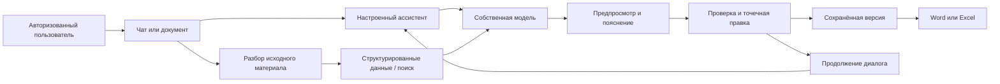

# AI Corp Chat

**Единое рабочее пространство команды: ИИ-чат, документы, аналитика и планы развития.**

[English](README.md) · **Русский**

Корпоративная ИИ-платформа для самостоятельного размещения на базе LibreChat. В ней объединены общение с моделями и ассистентами, перевод документов, автоматизация рыночных отчётов, работа с транскриптами и история развития сотрудников. Пользователь загружает материал, обсуждает задачу в чате, проверяет результат, вносит точечные правки и скачивает готовый документ.


> **Статус:** переносимая обезличенная редакция исходного кода существующего приложения. Основной интерфейс — на русском, документация — на русском и английском. В комплект не входят исходные аккаунты, чаты, записи сотрудников, загруженные документы, фирменное оформление и ключи провайдеров. Сохранены 10 шаблонов ассистентов с нейтральной привязкой владельца, без прежних файлов базы знаний. Для реальной генерации необходимо подключить собственные модели; скрытой имитации работающего ИИ здесь нет.

[Запуск](#быстрый-запуск) · [Возможности](#что-включено) · [Скриншоты](#скриншоты) · [Интеграции](#модели-и-база-знаний) · [Доступ](#роли-и-границы-данных) · [Архитектура](#архитектура-и-хранение) · [Проверки](#разработка-и-проверки) · [Ограничения](#текущие-ограничения) · [Участие](CONTRIBUTING.md) · [Лицензия](LICENSE)


Закрытый эталонный файл и извлечённый из него каталог описаний продуктов не включены. `api/server/services/MarketAnalysis/reference-catalog.json` — пустой шаблон: его можно наполнить разрешёнными справочными данными с указанием источника или использовать поиск документов в модуле. Макет отчёта, расчёты и экспорт сохранены.

## Основа проекта — LibreChat. Спасибо команде!

За основу AI Corp Chat взята открытая платформа [LibreChat](https://github.com/danny-avila/LibreChat). Она предоставляет базу для чатов, подключения моделей, ассистентов и администрирования; в этом проекте на её основе доработаны интерфейс и прикладные рабочие процессы.

**Огромная благодарность команде LibreChat и всем участникам проекта за их труд, открытый исходный код и основу, благодаря которой стало возможно создание этой платформы.** Исходная лицензия и сведения об авторских правах сохранены в [LICENSE](LICENSE).

## Для каких задач подходит

| Задача | Что уже предусмотрено | Что нужно предоставить |
|---|---|---|
| Независимый корпоративный чат | Аккаунты, личные беседы, поиск, закреплённые и недавние чаты, ассистенты, администрирование, светлая/тёмная тема | Docker, собственная модель и пользователи |
| Подготовка рыночных отчётов | Загрузка материалов, память анализа, программные расчёты, исследование источников, предпросмотр и Excel из двух листов | Выгрузки, законный доступ к закрытым источникам, текстовая и при необходимости визуальная модель |
| Билингвальные документы | DOCX/PDF, русский и английский текст, точечные правки, версии и Word | Модель перевода; Gemini/Vertex для визуального чтения PDF |
| История развития сотрудников | Транскрипты, коучинговые ассистенты, сохранение в ИПР, поиск сотрудников и динамика | Управленческие роли, свои транскрипты, модель |
| Публикация переиспользуемого проекта | Нейтральное оформление, двуязычная документация, изображения, шаблоны конфигурации и CI | Репозиторий, инфраструктура и собственные интеграции |

Копия сохраняет **возможности приложения**, а не чужие данные и подключённые аккаунты. Пустая база знаний не содержит документов прежней установки. Квоты, стоимость запросов и доступные идентификаторы моделей зависят от вашего аккаунта провайдера.

## Какие проблемы решает

| Проблема | Подход платформы |
|---|---|
| Работа с ИИ и документами разбросана по разным инструментам | Общая оболочка чата и специализированные рабочие области |
| Аналитические Excel-таблицы собираются копированием | Структурированный импорт, программные расчёты и единый экспорт |
| Для исправления пункта перевода приходится пересобирать документ | Выбор пункта, точечное редактирование и контроль версии |
| В предпросмотре нельзя продолжать диалог | Перемещаемый и сворачиваемый чат поверх документа |
| Разборы сотрудников теряются в отдельных беседах | История ИПР и поиск по сотрудникам с управленческими правами |
| Копия проекта переносит производственные ключи и файлы | Новая конфигурация, пустые хранилища, обезличенные шаблоны |

Ответ ИИ остаётся материалом для экспертной проверки. Платформа не гарантирует фактическую точность, юридическую достаточность перевода, доступ к платным базам и качество управленческой рекомендации.

## Что включено

- **Чат:** личные сессии, потоковые ответы, файлы, поиск, закреплённые/недавние беседы, копирование, оценка, озвучивание и экспорт ответа.
- **Ассистенты:** 10 шаблонов, файловый поиск, редактируемые инструкции, параметры моделей, права и четыре MCP-инструмента для анализа поставщиков и документов.
- **Рыночный анализ:** таблицы и другие поддерживаемые материалы; источники DSM Group/AlphaRM; ранжирование, выделенные бренды и «другие»; объём, доли, цены, динамика, CAGR; шаблонные комментарии, проверки и память конкретного анализа.
- **Предпросмотр отчёта:** рыночная таблица и дозировки, обсуждение во время просмотра, обновление после принятых правок и одна кнопка Excel с двумя пользовательскими листами.
- **Перевод документов:** DOCX/PDF, две языковые колонки, выбор пункта, правки через ИИ и вручную на обоих языках, проверка актуальности версии, история текста пункта, билингвальный Word.
- **Транскрипты и ИПР:** загрузка, сохранённые разборы, поиск по сотрудникам, категории МП/РМ/РГР/новички и анализ динамики с управленческим доступом.
- **Администрирование:** пользователи, роли, должности/подразделения, ассистенты, балансы/транзакции и настройки провайдеров базового приложения.
- **Развёртывание:** отдельный образ приложения, MongoDB, Meilisearch, PostgreSQL с векторами, RAG с OCR и дополнительный шлюз Caddy для HTTPS.

Границы модулей и поддерживаемые форматы описаны в [руководстве по модулям](docs/MODULES.md). Возможность, зависящая от внешнего сервиса, работает после его настройки.

## Скриншоты

Ниже — настоящие компоненты модулей с **синтетическими демонстрационными документами**. Изображения не содержат историю сотрудников и не подтверждают выполнение реального запроса к платной модели.

### Проверка билингвального документа


### Работа с рыночным отчётом


## Как устроен рабочий цикл



Рыночные показатели рассчитываются программно; модель понимает задачу, разбирает неоднозначные соответствия и объясняет результат. Перевод сохраняет проверенные правки выбранных пунктов. Незатронутые части документа должны сохраняться. Текущие блокировки задач находятся в памяти процесса: используйте **одну реплику API**, пока не реализована распределённая координация.

## Быстрый запуск

Нужны **Node.js 22+**, npm и Docker с Compose v2. Для сборки клиентской части предусмотрен лимит Node в 6 ГБ; выделите достаточно памяти. В Windows должен быть запущен Docker Desktop в режиме Linux-контейнеров.

В корне проекта:

```bash
npm run setup
```

Команда создаёт `.env`: новые ключи подписи/шифрования, пароли баз, ключ поиска и пароль администратора. Ключи моделей остаются пустыми. Существующий `.env` не перезаписывается.

До запуска отредактируйте `.env`:

1. Укажите свои `ADMIN_EMAIL` и `ADMIN_NAME`. Сгенерированный `ADMIN_PASSWORD` хранится в этом локальном файле и не выводится командой настройки.
2. Для стандартного текстового провайдера заполните `DEEPSEEK_API_KEY` либо настройте вариант Gemini ниже.
3. Для чтения PDF и визуальных рыночных материалов задайте `GOOGLE_KEY` или путь к собственному сервисному аккаунту Vertex.
4. Настройте эмбеддинги для поиска по документам. В шаблоне используются `OPENAI_API_KEY` и `text-embedding-3-small`; другой поддерживаемый провайдер потребует своих параметров.
5. Проверьте `CHAT_MODEL`, `DEEPSEEK_MODEL`, `CORP_GEMINI_MODEL` в своём аккаунте. Идентификаторы в шаблоне настраиваются и не гарантируют доступность модели.

Затем:

```bash
docker compose config -q
docker compose up -d --build
docker compose ps
```

Откройте **http://localhost:3088** и войдите со своими `ADMIN_EMAIL`/`ADMIN_PASSWORD`. Инициализация создаёт администратора только в пустой базе пользователей и добавляет 10 ассистентов. Повторный запуск сохраняет аккаунты, пароли, изменённые инструкции и историю.

Полезные команды:

```bash
docker compose logs --tail=100 api
docker compose exec api npm run seed:agents
docker compose stop
docker compose start
```

Не используйте `down -v`, если нужно сохранить данные: команда удаляет именованные тома. Учётные данные провайдеров не восстанавливаются из исходного проекта. HTTPS, резервное копирование и запуск без контейнеров описаны в [инструкции развёртывания](docs/DEPLOYMENT.md).

## Модели и база знаний

| Возможность | Настройки | Особенности |
|---|---|---|
| Чат и стандартные ассистенты | `CHAT_PROVIDER=DeepSeek`, `CHAT_MODEL`, `DEEPSEEK_API_KEY`, `DEEPSEEK_BASE_URL` | В `librechat.yaml` задан совместимый custom endpoint |
| Внутренняя текстовая генерация | `CORP_INTERNAL_AI_PROVIDER=deepseek`, `DEEPSEEK_MODEL` | Перевод, разбор/динамика ИПР, заголовки транскриптов |
| Внутренняя генерация Gemini | `CORP_INTERNAL_AI_PROVIDER=gemini`, `GOOGLE_KEY`, `CORP_GEMINI_MODEL` | Собственный аккаунт Google |
| Vertex AI | `GOOGLE_SERVICE_KEY_FILE=/app/secrets/google-service-account.json`, `GOOGLE_LOC` | Ваш файл в исключённой из Git папке `secrets/` |
| Первичная настройка ассистентов на Gemini | `CHAT_PROVIDER=google`, `CHAT_MODEL=<ваша модель>` перед созданием | Существующие ассистенты сохраняют настройки; меняйте их через интерфейс |
| Визуальное чтение PDF/рыночных материалов | `GOOGLE_KEY` либо Vertex | Один текстовый DeepSeek не включает визуальное распознавание |
| Поиск по документам | Провайдер/модель эмбеддингов и ключ | Отдельный RAG-сервис с OCR и векторной базой |
| Общий веб-поиск | Ключи провайдера поиска, `librechat.yaml` | Пустое значение не означает подключённый поиск |
| Речь и почта | `STT_*`, `TTS_*`, `EMAIL_*`, конфигурация провайдера | Необязательные интеграции; ограничения зависят от сервиса/браузера |

**DSM Group и AlphaRM сохранены как публичные исследовательские источники.** Публичная страница не даёт доступа к закрытой базе. При отсутствии открытых данных загружайте разрешённые выгрузки; отделяйте проверенные цифры от пропусков и допущений. Модуль не обходит авторизацию/оплату и не должен складывать пересекающиеся источники как независимые продажи.

Прежние файлы базы знаний, векторные идентификаторы, привязки документов и контакты не перенесены. Добавьте свой корпус, подключите его к ассистентам и проверьте поиск. Включённый патч совместимости Gemini применяется при установке зависимостей и заменяет производственные подключения изменённых файлов.

## Роли и границы данных

| Область | Правило этой редакции |
|---|---|
| Личные чаты и переводы | Сессии/документы принадлежат пользователю; администратор не получает чужие переводы в личном списке |
| Рыночный анализ | Доступен авторизованным пользователям; адресный whitelist удалён, анализы остаются личными |
| Каталог ассистентов | Шаблоны доступны для просмотра/использования авторизованным пользователям; владелец — администратор новой установки |
| ИПР | Иерархия `RM`, `RGR`, `ROP`, `TRAINER`, администратор; некоторые категории намеренно доступны старшим ролям |
| Управление пользователями | Администратор |

Публичность ассистента — право внутри приложения, а не публикация чатов без авторизации. Это приложение для одной организации с разделением аккаунтов, **не сертифицированная многопользовательская SaaS-платформа с изоляцией организаций**. Проверьте управленческую иерархию ИПР до загрузки персональных записей. Названия медицинских должностей сохранены как отраслевые шаблоны и могут быть адаптированы.

## Архитектура и хранение

| Компонент | Назначение | Хранение |
|---|---|---|
| `client/`, React/TypeScript/Vite | Оболочка, предпросмотр, ассистенты, транскрипты, динамика | Браузер и API |
| `api/`, Node.js/Express | Авторизация, права, задачи, импорт, экспорт, версии | MongoDB и файловые каталоги |
| `packages/` | Общие типы, схемы и библиотеки | Собранные workspace-пакеты |
| MongoDB | Аккаунты, чаты, ассистенты, транскрипты, ИПР | `mongo_data` |
| Meilisearch | Поддержка поиска | `meili_data` |
| PostgreSQL/pgvector | Векторы и необязательная телеметрия токенов | `vector_data` |
| `deployment/rag-ocr/` | Загрузка документов, OCR рус./англ. | Векторная база и свои файлы |
| Документы | Оригиналы, состояние анализов/переводов, результаты | `uploads` |
| Дополнительный Caddy | HTTPS | `caddy_data`, `caddy_config` |

По умолчанию наружу на loopback публикуется только API. Базы и RAG работают во внутренней сети Compose. Резервируйте MongoDB и файловое хранилище, а также векторы/телеметрию. Исходный код не является резервной копией записей работающей организации.

## Структура проекта

```text
api/                         Сервер и бизнес-модули
client/                      Клиент и нейтральные изображения
packages/                    Общие библиотеки
config/seed/agents.json       10 обезличенных ассистентов
deployment/rag-ocr/           RAG с OCR и загрузчик
deployment/Caddyfile          Дополнительный HTTPS
scripts/                     Настройка, инициализация, проверки, архив
docs/                        Руководства, изображения, результаты проверок
.github/workflows/ci.yml      Установка, проверки, тесты, сборка
.env.example                 Настройки без рабочих ключей
librechat.yaml               Провайдеры, ассистенты, MCP
docker-compose.yml           Независимая локальная установка
docker-compose.production.yml Дополнение для HTTPS
README.md / README.ru.md      Английская / русская документация
```

## Разработка и проверки

```bash
npm ci
npm ci --prefix api/server/services/MarketAnalysis
npm ci --prefix api/server/services/SupplierTools
npm run test:portable
npm run check:public
npm run build
```

Сборка включает общие workspace-пакеты и frontend. Зависимости вложенных бизнес-модулей устанавливаются отдельно. Git исключает зависимости, сборки и пользовательские данные. Проверка публичного исходного кода ищет известные идентифицирующие строки и признаки ключей, не выводя их значения; это эвристика, не полноценный аудит.

Дополнительный smoke-тест запускает **одноразовую MongoDB**, инициализирует администратора/ассистентов, проверяет авторизованные маршруты и удаляет временную базу. Он скачивает бинарник MongoDB; общие пакеты и frontend должны быть собраны:

```bash
node scripts/tests/fresh-instance.cjs
node scripts/tests/mcp-smoke.cjs
```

Фактически выполненные проверки и их ограничения описаны в [VALIDATION](docs/VALIDATION.md). Сборка интерфейса не подтверждает работу ваших ключей моделей, RAG, почты и всей Docker-установки.

## Архив и публикация на GitHub

```bash
npm run check:public
npm run release
```

Архив создаётся в родительской директории. В него входят исходники, документация и собранный frontend; не входят Git-история, `.env`, ключи, зависимости, базы, логи и загруженные документы. Существующий архив не перезаписывается. На новой машине установите зависимости и создайте свою конфигурацию.

Папка подготовлена как независимый Git-репозиторий. Перед публикацией проверьте `git status` и исходники. Удалённый репозиторий автоматически не создаётся, отправка на GitHub не выполняется. Сохраняйте лицензию и авторство LibreChat, а также лицензии зависимостей — см. [NOTICE](NOTICE).

После создания пустого репозитория GitHub отправьте исходники через Git, заменив `YOUR_ORG` на владельца. Это инструкция: удалённая публикация за вас не выполнялась.

```bash
git add .
git commit -m "Initial portable source edition"
git remote add origin https://github.com/YOUR_ORG/AI_Corp_Chat.git
git push -u origin main
```

## Текущие ограничения

- Ключи моделей, эмбеддингов, поиска, речи и почты предоставляет владелец установки. Отсутствие ключа не маскируется вымышленным успешным результатом.
- Визуальное чтение PDF использует Gemini/Vertex даже при текстовой генерации через DeepSeek. Защищённые/нечёткие файлы требуют читаемой копии и проверки.
- Перевод принимает DOCX/PDF до 20 МБ и PDF до 80 страниц. Цель — сохранить текст и структуру таблиц; перенос печатей, подписей и произвольной вёрстки не гарантируется.
- Есть счётчик версии и история текста пункта; отдельного полноценного интерфейса восстановления всех версий документа нет.
- Чат перемещается внутри видимой области браузера, не по рабочему столу за пределами окна.
- Открытые рыночные сводки могут быть неполными. Точный товарный отчёт требует детализированных разрешённых данных.
- Блокировки локальны процессу; несколько реплик API требуют распределённой координации и общего хранилища.
- Права ИПР следуют управленческой иерархии; настройте роли и сроки хранения перед использованием записей сотрудников.
- Всю Docker-установку и платные интеграции необходимо проверить в своей инфраструктуре. Синтетические проверки без модели не равны готовности к эксплуатации.
- Production-сборка не заменяет полную проверку типов, lint и регрессионный набор базового проекта; см. журнал проверок.

## Лицензия и основа проекта

База LibreChat сохраняет **MIT-лицензию и исходные сведения об авторских правах**. Дополнительная документация и инструменты переносимости распространяются на тех же условиях, если не указано иное. Зависимости сохраняют собственные лицензии. Проект не представляет провайдеров моделей или издателей рыночных данных и не заявляет их одобрение.

См. [CONTRIBUTING](CONTRIBUTING.md), [SECURITY](SECURITY.md), [CHANGELOG](CHANGELOG.md), [NOTICE](NOTICE), [LICENSE](LICENSE).
